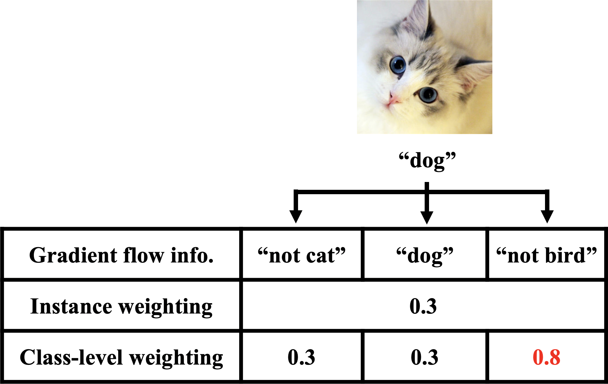

# Generalized Data Weighting via Class-level Gradient Manipulation

This repository is the official implementation of [Generalized Data Weighting via Class-level Gradient Manipulation (NeurIPS 2021)](http://arxiv.org/abs/2111.00056). If you find our code useful in your research then please cite:

<div  align="center"> 

</div>

@misc{chen2021generalized,
      title={Generalized Data Weighting via Class-level Gradient Manipulation}, 
      author={Can Chen and Shuhao Zheng and Xi Chen and Erqun Dong and Xue Liu and Hao Liu and Dejing Dou},
      year={2021},
      eprint={2111.00056},
      archivePrefix={arXiv},
      primaryClass={cs.CV}
}


## Requirements

- Linux
- Python 3.7
- Pytorch 1.9.0
- Torchvision 0.9.1

More specifically, run this command:

```setup
pip install -r requirements.txt
```

## Run mw-net and gdw on CIFAR10

Download [CIFAR10](https://www.cs.toronto.edu/~kriz/cifar.html) and place it in *./data*.

To compare mw-net and gdw on CIFAR10 under 40% uniform noise, run this command:
```train
python -u  main.py --corruption_prob 0.4 --dataset cifar10 --mode mw-net --outer_lr 100
python -u  main.py --corruption_prob 0.4 --dataset cifar10 --mode gdw --outer_lr 100
```
We set the outer level learning as 100 on CIFAR10 and 1000 on CIFAR100.

## Results
We place training logs of the above command in *./log* and list results as below:

| Method         | mw-net  | gdw |
| ------------------ |---------------- | -------------- |
| Accuracy   |     86.62%         |      87.97%       |


## Acknowledgements
We thank the Pytorch implementation on mw-net(https://github.com/xjtushujun/meta-weight-net).
